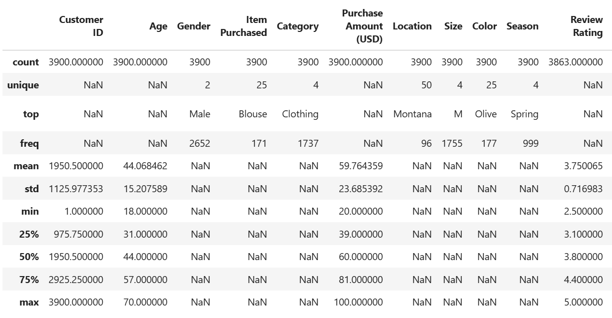
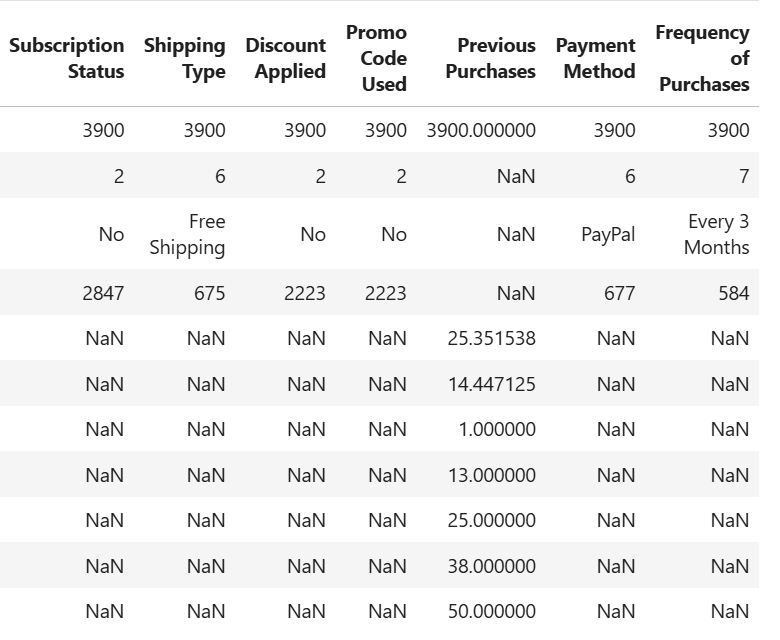

# Customer Behaviour Dashboard 

### Dashboard Link : https://app.powerbi.com/groups/me/reports/034e7513-d911-4564-9cb3-2b2f1504bf9d/056de2ed52b09b897e04?experience=power-bi

## Problem Statement

A mid-sized retail business has experienced rapid growth across its online and offline sales channels. Although large volumes of customer transaction data are available, the company lacks meaningful insights into customer purchasing behaviour, product performance, seasonal demand, and customer retention.
As a Data Analyst, my responsibility is to transform raw consumer shopping data into actionable business insights. This project focuses on identifying customer segments, analysing purchase patterns, evaluating the impact of discounts, ratings, payment methods, and seasonal trends, and providing recommendations that support data-driven decision-making. The ultimate goal is to help the business improve customer experience, optimise marketing campaigns, and increase overall sales performance.

### Steps followed 
### Exploratory Data Analysis using Python

- Step 1 - Data Loading : Imported the dataset using pandas.

- Step 2 - Initial Exploration : Used df.info() to check structure and df.describe() for
summary statistics.
  
   
  
  
- Step 3 - Missing Data Handling : Checked for null values and imputed missing values in the
Review Rating column using the median rating of each product category.

- Step 4 - Column Standardization : Renamed columns to snake case for better readability and
documentation.

- Step 5 - Feature Engineering :
  
     Created age_group column by binning customer ages.

     Created purchase_frequency_days column from purchase data.

- Step 6 - Data Consistency Check : Verified if discount_applied and promo_code_used
were redundant; dropped promo_code_used.

- Step 7 - Database Integration : Connected Python script to MYSQL and loaded the cleaned
DataFrame into the database for SQL analysis.

  ###  Data Analysis using SQL (Business Transactions)
  
  We performed structured analysis in MYSQL to answer key business questions :
  
- Step 8 - Revenue by Gender – Compared total revenue generated by male vs. female
customers.

   Following SQL Query was written for the same
  
      Select gender,SUM(purchased_amount) as revenue
      from customer 
      group by gender;
  
- Step 9 - High-Spending Discount Users – Identified customers who used discounts but still
spent above the average purchase amount.

   Following SQL Query was written for the same

       Select customer_id, purchased_amount
       from customer 
       where discount_applied ='Yes' and purchased_amount>(select Avg(purchased_amount) from customer);

- Step 10 - Top 5 Products by Rating – Found products with the highest average review ratings

   Following SQL Query was written for the same

       Select item_purchased ,Round( AVG(review_rating),2) as product_avg_rating
       from customer
       group by item_purchased
       order by AVG(review_rating) DESC
       Limit 5;

- Step 11 - Shipping Type Comparison – Compared average purchase amounts between
Standard and Express shipping.

    Following SQL Query was written for the same
  
       Select shipping_type, Round(AVG(purchased_amount),2)
       From customer 
       where shipping_type in ('Standard','Express')
       group by shipping_type;

- Step 12 - Subscribers vs. Non-Subscribers – Compared average spend and total revenue
across subscription status.

    Following SQL Query was written for the same

      Select subscription_status,
      COUNT(customer_id) as Total_customers,
      ROUND(AVG(purchased_amount),2) as Avg_spend,
      ROUND(SUM(Purchased_amount),2) as Total_revenue
      From customer
      group by subscription_status
      order by Total_revenue ,Avg_spend DESC;

- Step 13 - Discount-Dependent Products – Identified 5 products with the highest percentage of
discounted purchases.

    Following SQL Query was written for the same
  
      Select item_purchased,
      Round(100 * SUM(CASE when discount_applied='Yes' THEN 1 ELSE 0 END )/COUNT(*),2) as Discount_rate
      from customer
      group by item_purchased
      order by Discount_rate DESC
      LIMIT 5;

- Step 14 - Customer Segmentation – Classified customers into New, Returning, and Loyal
segments based on purchase history.

     Following SQL Query was written for the same

      With customer_type as(
      Select customer_id,previous_purchases,
      CASE 
      When previous_purchases = 1 THEN 'New'
      When Previous_purchases between 1 and 10 THEN 'Returning'
      Else 'Loyal'
      END as customer_segment
      From customer
      )
      Select customer_segment, count(*) as Total_no_customers
      from customer_type
      group by customer_segment;

- Step 15 - Top 3 Products per Category – Listed the most purchased products within each
category.

   Following SQL Query was written for the same

      With item_count as(
      Select category,
      item_purchased,
      Count(customer_id) as Total_orders,
      ROW_number() over(partition by Category order by Count(customer_id) DESC) as Item_rank 
      From customer
      group by category, item_purchased
      )
      Select item_rank ,category,item_purchased,Total_orders
      from item_count
      Where item_rank<=3;

 - Step 16 - Repeat Buyers & Subscriptions – Checked whether customers with >5 purchases are
more likely to subscribe.

 Following SQL Query was written for the same 
  
     Select subscription_status,
     COUNT(customer_id) as Repeat_Buyers 
     from customer
     Where previous_purchases>5
     group by subscription_status;
 
- Step 17 - Revenue by Age Group – Calculated total revenue contribution of each age group.
  
  Following SQL Query was written for the same
 
      Select age_group,
      SUM(purchased_amount) as Total_revenue
      from customer
      group by age_group
      order by Total_revenue DESC;
  
  ### Dashboard in Power BI
  
- Step 18 : Load data into Power BI Desktop

- Step 19 : Open power query editor & in view tab under Data preview section, check "column distribution", "column quality" & "column profile" options.

- Step 20 :  Also since by default, profile will be opened only for 1000 rows so we need to select "column profiling based on entire dataset".

- Step 21 : In the report view, under the view tab, theme was selected.

- Step 22 :  New measure was created to find total Number of customers.

  Following DAX expression was written for the same,

              Number of Customers = COUNT('customer_behaviour customer'[customer_id])

- Step 23 : New measure was created to find Avearge of purchase Amount.

  Following DAX expression was written for the same,

             Avearge of Purchase Amount = AVERAGE('customer_behaviour customer'[purchased_amount])

- Step 24 : New measure was created to find Avearge Review Rating .

  Following DAX expression was written for the same,

              Avearge Review Rating = AVERAGE('customer_behaviour customer'[review_rating])

    
- Step 25 : The report was then published to Power BI Service.
 
 

# Snapshot of Dashboard (Power BI Service)

 
 # Report Snapshot (Power BI DESKTOP)

 

# Insights

A single page report was created on Power BI Desktop & it was then published to Power BI Service.

Following inferences can be drawn from the dashboard;

### [1] Total Number of Customers = 129880

   Number of satisfied Customers (Male) = 28159 (21.68 %)

   Number of satisfied Customers (Female) = 28269 (21.76 %)

   Number of neutral/unsatisfied customers (Male) = 35822 (27.58 %)

   Number of neutral/unsatisfied customers (Female) = 37630 (28.97 %)

           thus, higher number of customers are neutral/unsatisfied.
           
### [2] Average Ratings

    a) Baggage Handling - 3.63/5
    b) Check-in Service - 3.31/5
    c) Cleanliness - 3.29/5
    d) Ease of online booking - 2.88/5
    e) Food & Drink - 3.21/5
    f) In-flight Entertainment - 3.36/5
    g) In-flight service - 3.64/5
    h) In-flight Wifi service - 2.81/5
    i) Leg room service - 3.37/5
    j) On-board service - 3.38/5
    k) Online boarding - 3.33/5
    l) Seat comfort - 3.44/5
    m) Departure & arrival convenience - 3.22/5
  
  while calculating average rating, null values have been ignored as they were not relevant for some customers. 
  
  These ratings will change if different visual filters will be applied.  
  
  ### [3] Average Delay 
  
      a) Average delay in arrival(minutes) - 15.09
      b) Average delay in departure(minutes) - 14.71
Average delay will change if different visual filters will be applied.

 ### [4] Some other insights
 
 ### Class
 
 1.1) 47.87 % customers travelled by Business class.
 
 1.2) 44.89 % customers travelled by Economy class.
 
 1.3) 7.25 % customers travelled by Economy plus class.
 
         thus, maximum customers travelled by Business class.
 
 ### Age Group
 
 2.1)  21.69 % customers belong to '0-25' age group.
 
 2.2)  52.44 % customers belong to '25-50' age group.
 
 2.3)  25.57 % customers belong to '50-75' age group.
 
 2.4)  0.31 % customers belong to '75-100' age group.
 
         thus, maximum customers belong to '25-50' age group.
         
### Customer Type

3.1) 18.31 % customers have customer type 'First time'.

3.2) 81.69 % customers have customer type 'returning'.
       
       thus, more customers have customer type 'returning'.

### Type of travel

4.1) 69.06 % customers have travel type 'Business'.

4.2) 30.94 % customers have travel type 'Personal'.

        thus, more customers have travel type 'Business'.

